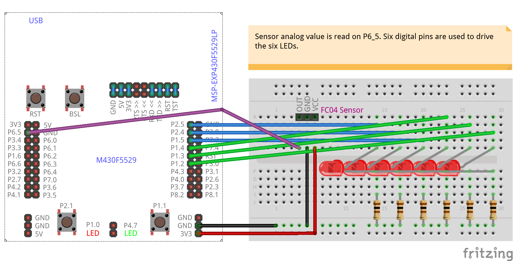
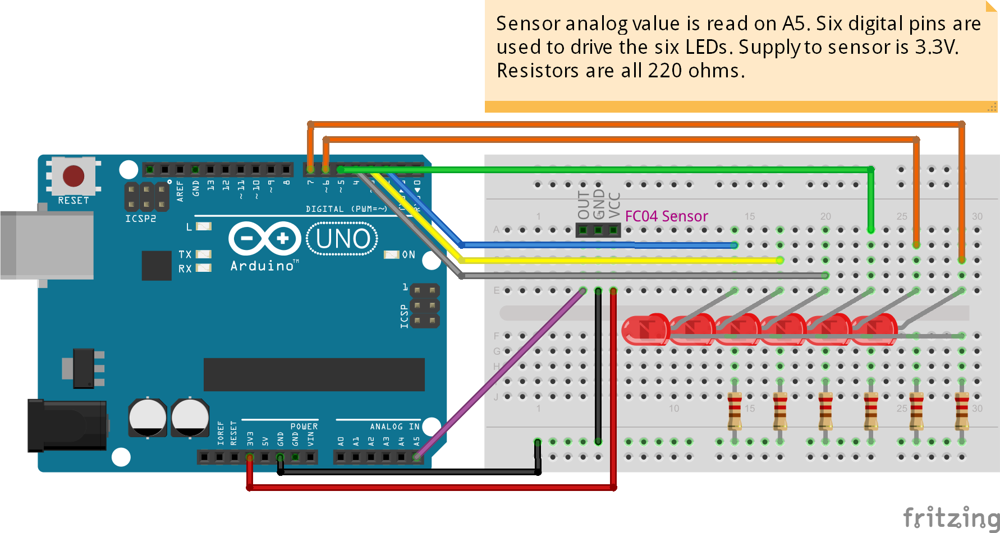

# FC04-SoundSensor
<table><tr>
<td>
 
 
</td>
<td>
<b>Boards</b>
<pre>ArduinoUno, LaunchPadF5529</pre>

<b>Description</b>
<pre>FC04 sound sensor is to read an analog value. Value is
used to drive an LED array that is supposed to light up to
indicate sound loudness. This sensor responds well to base
sounds (low frequency bands). In any case, adjust the
trimmer on the module to suit your application.
</pre>

</td>
</tr></table>

