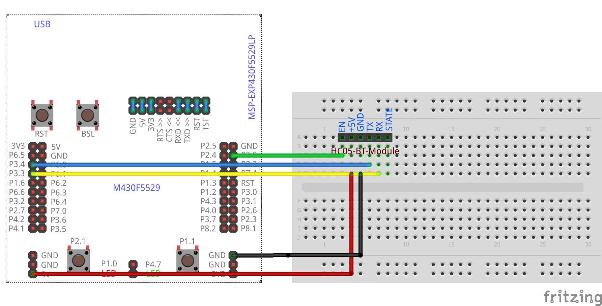
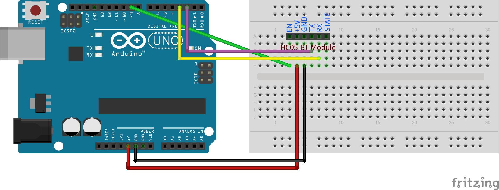

# HC05-AT-Cmds
<table><tr>
<td>
 
 
</td>
<td>
<b>Boards</b>
<pre>ArduinoUno, LaunchPadF5529</pre>

<b>Description</b>
<pre>Put the Bluetooth module in AT command mode. Run a bunch of
commands to configure the module. Module must be forced to
enter AT command mode by long pressing the reset button
before powering it up.
</pre>

</td>
</tr></table>

