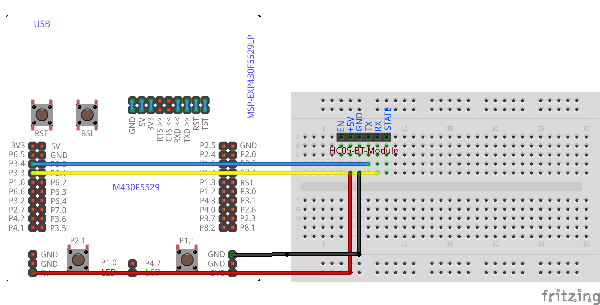

# HC05-Bluetooth
<table><tr>
<td>
 
 
</td>
<td>
<b>Boards</b>
<pre>ArduinoUno, LaunchPadF5529</pre>

<b>Description</b>
<pre>Send commands from an Android device via Bluetooth to turn
on/off or blink and LED. A suggested Android app is the
Bluetooth SPP Tools Pro.
</pre>

</td>
</tr></table>

