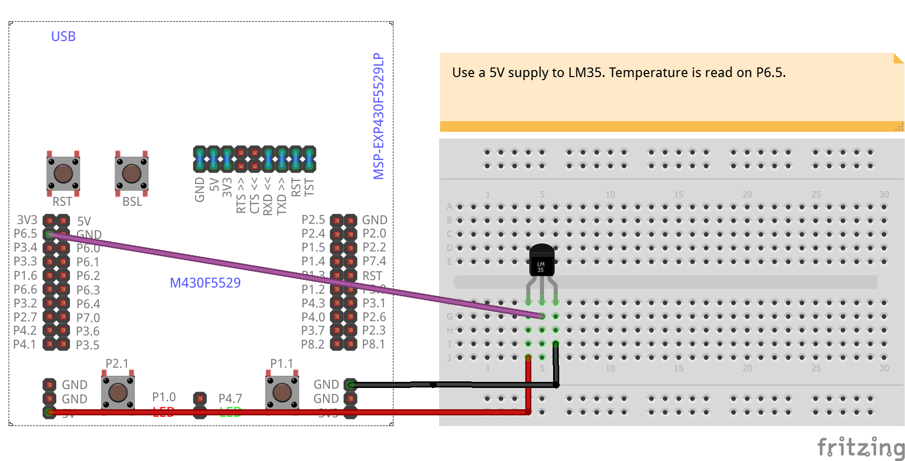

# LM35
<table><tr>
<td>
 
 
 
 
</td>
<td>
<b>Boards</b>
<pre>ArduinoUno, LaunchPadF5529</pre>

<b>Description</b>
<pre>Use analog input to read temperature measurement from LM35.
</pre>

</td>
</tr></table>

