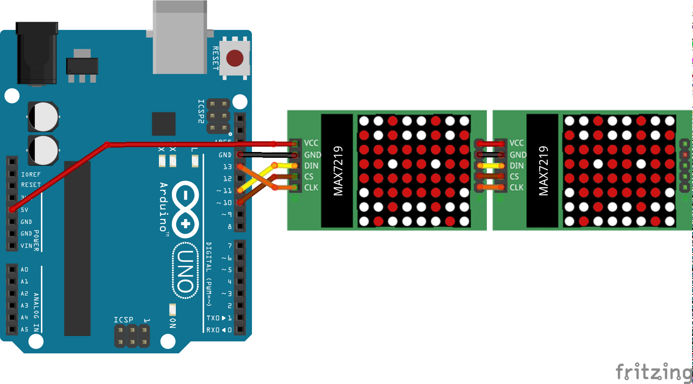

# LedMatrix-Max7219
<table><tr>
<td>
 
</td>
<td>
<b>Boards</b>
<pre>ArduinoUno, LaunchPadF5529</pre>

<b>Description</b>
<pre>Drive one or more 8x8 LED matrices using MAX7219. SPI is
is used for interfacing. Two variants are presented below:
0: From first principles.
1: Two 8x8 matrices using LedControl library.
</pre>

</td>
</tr></table>

