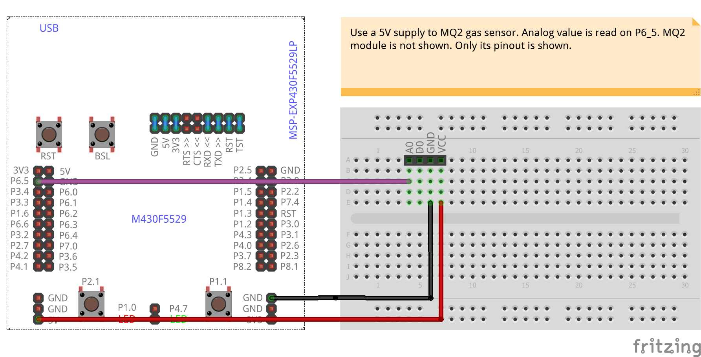

# MQ2-GasSensor
<table><tr>
<td>
 
 
</td>
<td>
<b>Boards</b>
<pre>ArduinoUno, LaunchPadF5529</pre>

<b>Description</b>
<pre>Use MQ2 gas sensor module and read analog values. The code
also includes calibration. Since the mapping betweeen Rs
and PPM is non-linear no conversion to PPM is done at the
moment. No compensation has been included for current
humidity and temperature.
</pre>

</td>
</tr></table>

