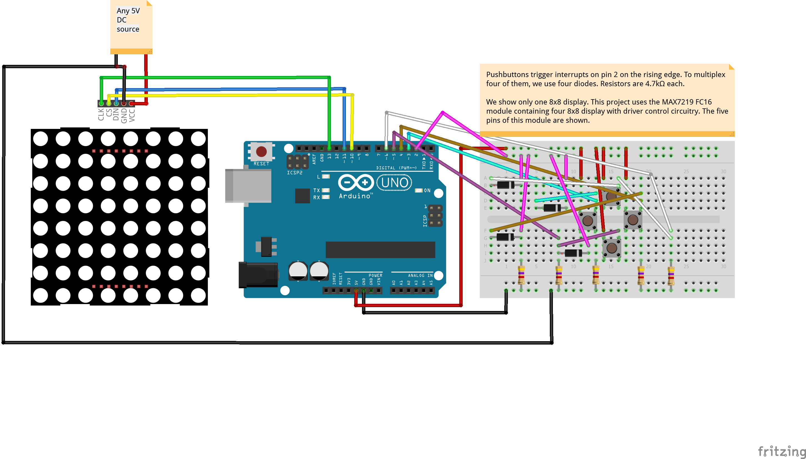

# Tetris-FC16
<table><tr>
<td>
 
</td>
<td>
<b>Boards</b>
<pre>ArduinoUno</pre>

<b>Description</b>
<pre>Tetris game is implemented. Display uses the MAX7219 FC16
module that cascades four 8x8 dot matrix displays. For user
control, we use four pushbuttons. The displays should be 
powered by an independent power supply and not from the
Arduino.
</pre>

</td>
</tr></table>

