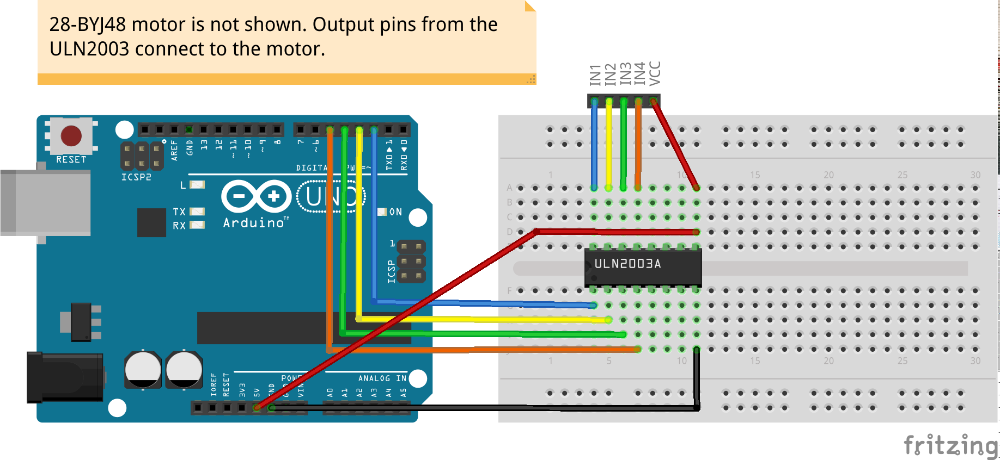
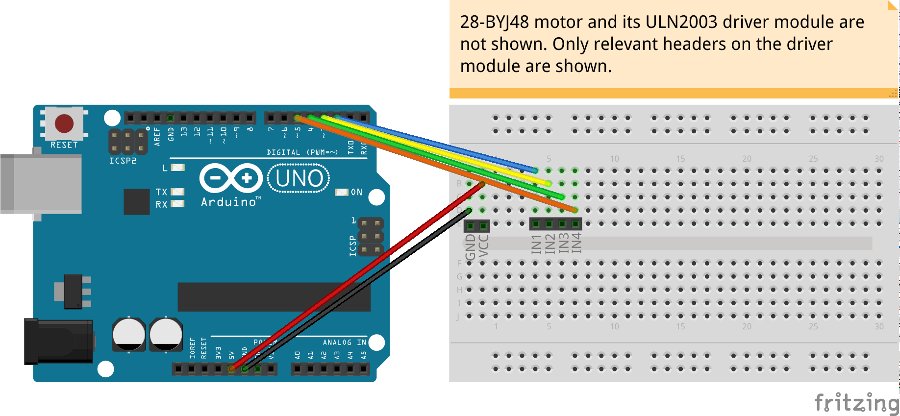

# UnipolarStepper
<table><tr>
<td>
 
 
</td>
<td>
<b>Boards</b>
<pre>ArduinoUno, LaunchPadF5529</pre>

<b>Description</b>
<pre>Drive the unipolar stepper motor 28-BYJ48 that has 5 wires.
ULN2003 driver module is used for the purpose. It's also
possible to use the ULN2003 chip directly without the
dedicated module. There are different implementations in
this code for illustration:
0: Using Stepper library.
1: Half-wave drive from first principles.
2: Using third-party AccelStepper library.
3: With acceleration using AccelStepper library.
</pre>

</td>
</tr></table>

