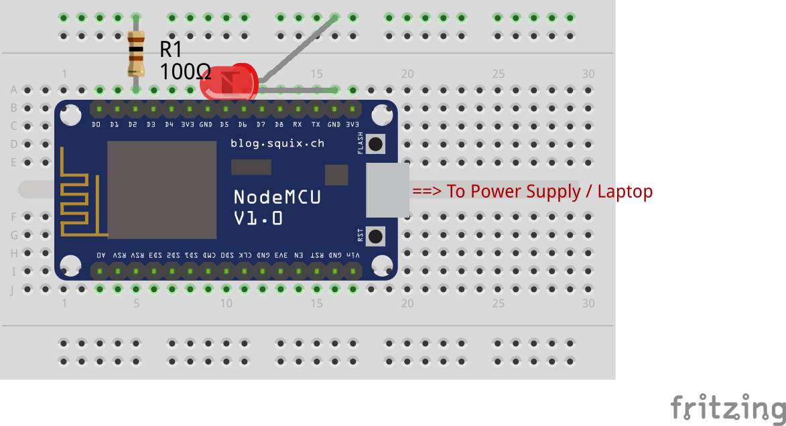

# Blynk-Blink
<table><tr>
<td>
 
</td>
<td>
<b>Boards</b>
<pre>NodeMCU</pre>

<b>Description</b>
<pre>Control an LED manually from the Blynk app. This code can
be compiled and uploaded from Arduino IDE. Update the code
with your token, Wi-Fi SSID and password.
</pre>

</td>
</tr></table>

