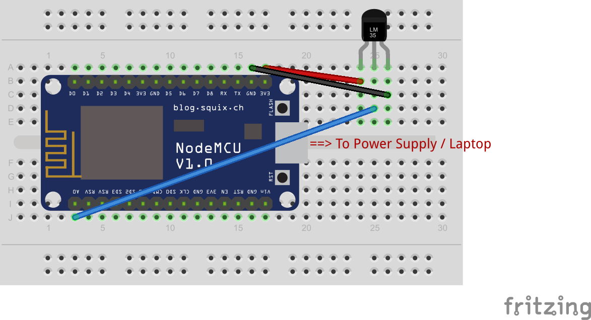

# Blynk-LM35
<table><tr>
<td>
 
</td>
<td>
<b>Boards</b>
<pre>NodeMCU</pre>

<b>Description</b>
<pre>Send temperature readings from LM35 and display the same
on the Blynk app.
</pre>

</td>
</tr></table>

