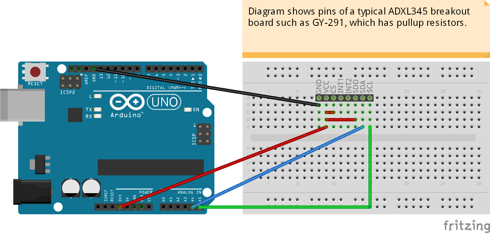
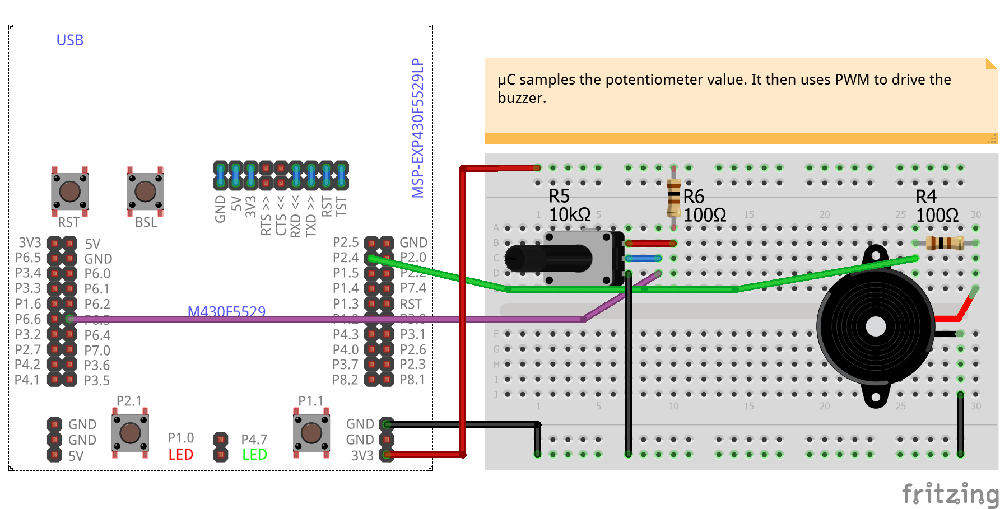
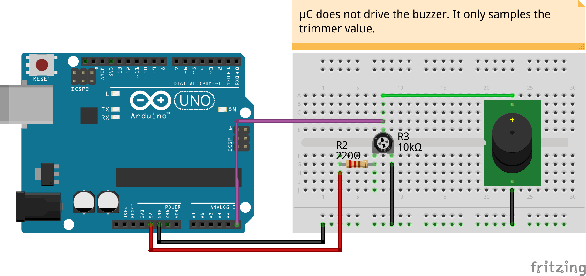
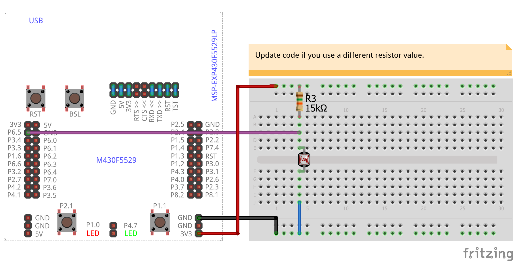
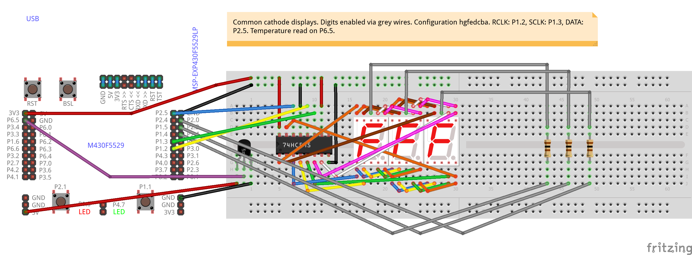
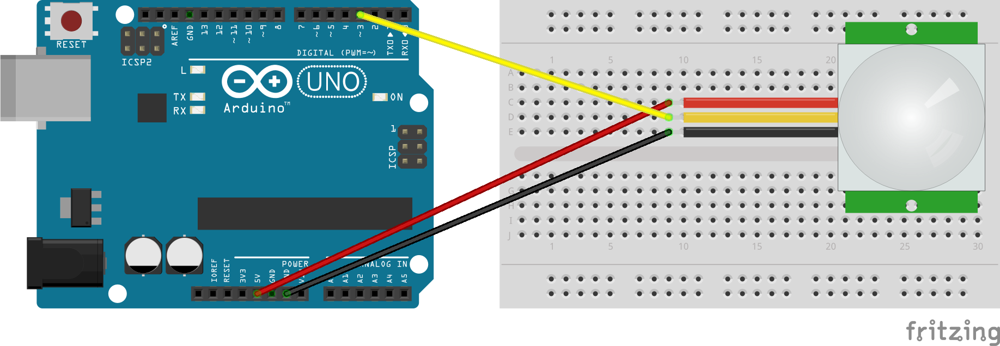
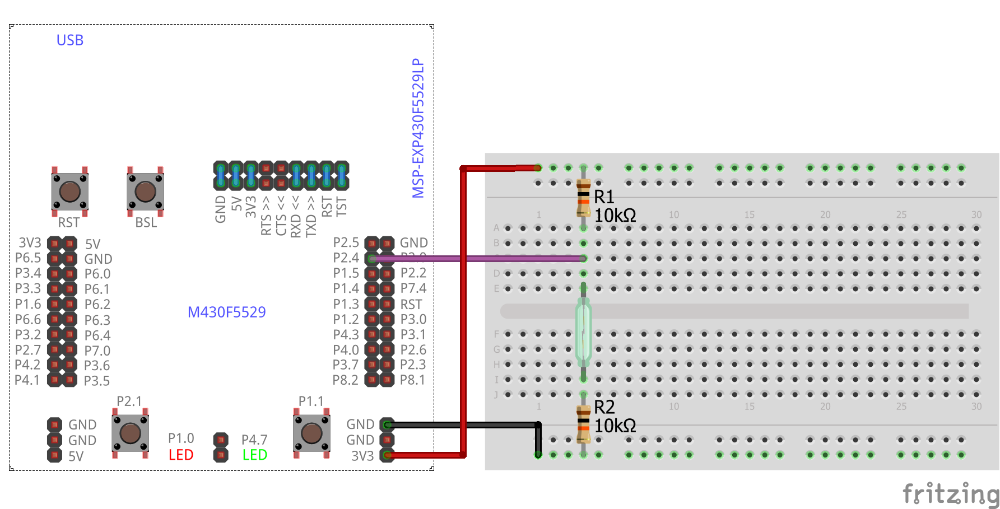
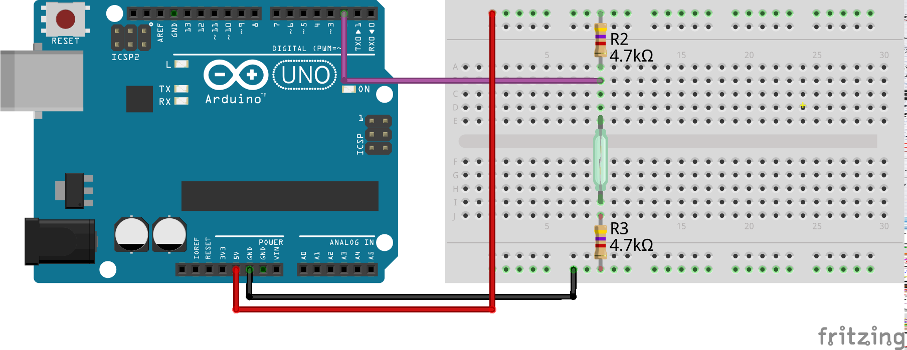
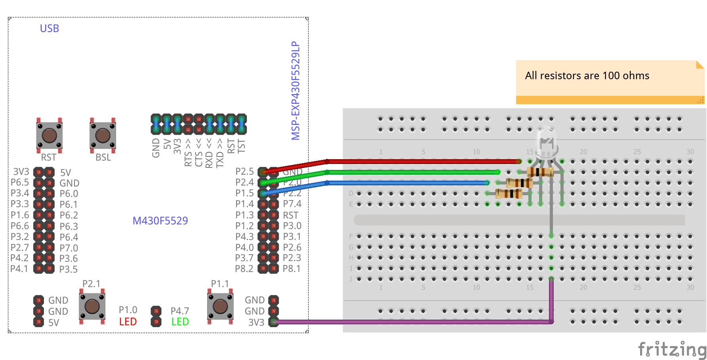
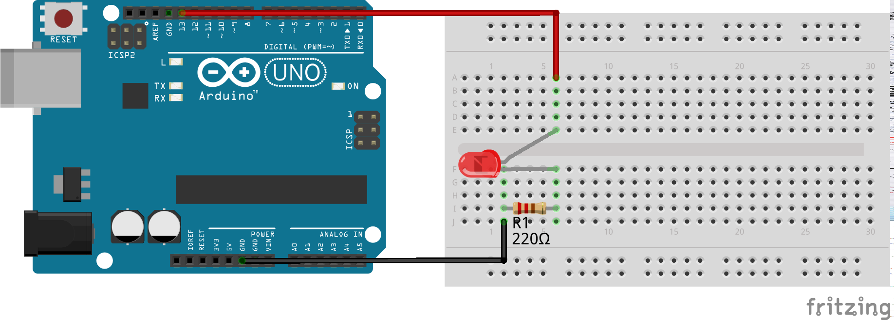

# Overview
A collection of examples for getting started in the Internet of Things (IoT). This includes code, wiring diagrams and documentation. In the description of each example, we list supported/tested boards. The same code may work on other boards with no or minimal changes. Files are organized in the following manner:

* `admin`: Utilities for maintaining this repo.
* `Arduino`: Projects on Arduino and Energia. Most examples are about Arduino Uno and TI LaunchPadF5529.
* `NodeMCU`: Projects on NodeMCU including those that can be programmed via Arduino IDE.
* `RaspberryPi`: Projects on mostly Raspberry Pi 2, although examples may work with other variants.

Examples using other platforms such as Intel Edison, Broadcom WICED or ARM mbedmay be added in future.
# Basic Examples

## ADXL345I2C
<table><tr>
<td>
 
</td>
<td>
<b>Boards</b>
<pre>ArduinoUno</pre>

<b>Description</b>
<pre>Interface to the ADXL345 accelerometer via I2C.
</pre>

</td>
</tr></table>

## ADXL345SPI
<table><tr>
<td>
 
</td>
<td>
<b>Boards</b>
<pre>ArduinoUno, LaunchPadF5529</pre>

<b>Description</b>
<pre>Interface to the ADXL345 accelerometer via SPI.
</pre>

</td>
</tr></table>

## Blink
<table><tr>
<td>
 
 
</td>
<td>
<b>Boards</b>
<pre>ArduinoUno, LaunchPadF5529</pre>

<b>Description</b>
<pre>Blink two LEDs alternatively. One LED is on the board and
the other is connected externally.
</pre>

</td>
</tr></table>

## BuzzerPot
<table><tr>
<td>
 
 
 
 
</td>
<td>
<b>Boards</b>
<pre>ArduinoUno, LaunchPadF5529</pre>

<b>Description</b>
<pre>Using a potentiometer, drive a buzzer. We illustrate two
variations:
DIRECT   : Buzzer is directly connected to potentiometer.
WITH_PWM : Buzzer is sampled by microcontroller, which then
uses PWM to drive the buzzer.
</pre>

</td>
</tr></table>

## DigitalRead
<table><tr>
<td>
 
</td>
<td>
<b>Boards</b>
<pre>ArduinoUno, LaunchPadF5529</pre>

<b>Description</b>
<pre>Investigate the effect of pressing a push button by reading
the voltage as a digital value. The value is printed on the
serial monitor but also used to light up an LED.
</pre>

</td>
</tr></table>

## FC04-SoundSensor
<table><tr>
<td>
 
 
</td>
<td>
<b>Boards</b>
<pre>ArduinoUno, LaunchPadF5529</pre>

<b>Description</b>
<pre>FC04 sound sensor is to read an analog value. Value is
used to drive an LED array that is supposed to light up to
indicate sound loudness. This sensor responds well to base
sounds (low frequency bands). In any case, adjust the
trimmer on the module to suit your application.
</pre>

</td>
</tr></table>

## HC05-Bluetooth
<table><tr>
<td>
 
</td>
<td>
<b>Boards</b>
<pre>ArduinoUno, LaunchPadF5529</pre>

<b>Description</b>
<pre>Send commands from an Android device via Bluetooth to turn
on/off or blink and LED. A suggested Android app is the
Bluetooth SPP Tools Pro.
</pre>

</td>
</tr></table>

## HCSR04-Ultrasonic
<table><tr>
<td>
 
</td>
<td>
<b>Boards</b>
<pre>ArduinoUno, LaunchPadF5529</pre>

<b>Description</b>
<pre>Sense the distance of an object/obstacle using ultrasound.
</pre>

</td>
</tr></table>

## HallEffect3144
<table><tr>
<td>
 
 
</td>
<td>
<b>Boards</b>
<pre>ArduinoUno, LaunchPadF5529</pre>

<b>Description</b>
<pre>Detect door open/close events using a hall effect sensor.
Note that the orientation of the magnet (North pole or
South pole) matters. This example shows how to write
interrupt code.
</pre>

</td>
</tr></table>

## IR-Promixity-Detection
<table><tr>
<td>
 
</td>
<td>
<b>Boards</b>
<pre>ArduinoUno, LaunchPadF5529</pre>

<b>Description</b>
<pre>Use an IR LED and an IR photodiode to detect proximity of
an obstable. An indicator LED glows in response to the
proximity of the obstacle. This indicator can be programmed
as a digital or an analog output.
</pre>

</td>
</tr></table>

## IR-RemoteControl
<table><tr>
<td>
 
</td>
<td>
<b>Boards</b>
<pre>ArduinoUno, LaunchPadF5529</pre>

<b>Description</b>
<pre>Use an IR receiver/decoder to decode and store commands
from a household remote control. Use an IR LED to send the
commands to the household gadget/appliance.
</pre>

</td>
</tr></table>

## LCD-2x16-Joystick
<table><tr>
<td>
 
</td>
<td>
<b>Boards</b>
<pre>ArduinoUno, LaunchPadF5529</pre>

<b>Description</b>
<pre>Read values from a joystick and display the same on a 2x16
line LCD module. LiquidCrystal library is used in this
example. 4-pin mode is used for the LCD. Since RW pin is
grounded, only write operation is possible.
</pre>

</td>
</tr></table>

## LDR
<table><tr>
<td>
 
 
</td>
<td>
<b>Boards</b>
<pre>ArduinoUno, LaunchPadF5529</pre>

<b>Description</b>
<pre>LDR is a light dependant resistor. Read the analog voltage
across the LDR and derive the resistance.
</pre>

</td>
</tr></table>

## LM35-7Segx3
<table><tr>
<td>
 
 
</td>
<td>
<b>Boards</b>
<pre>ArduinoUno, LaunchPadF5529</pre>

<b>Description</b>
<pre>Use LM35 to sense temperature that is displayed. 
Use 74HC595 shift register to control 3 7-segment displays.
</pre>

</td>
</tr></table>

## LM35
<table><tr>
<td>
 
 
</td>
<td>
<b>Boards</b>
<pre>ArduinoUno, LaunchPadF5529</pre>

<b>Description</b>
<pre>Use analog input to read temperature measurement from LM35.
</pre>

</td>
</tr></table>

## LedMatrix-Max7219
<table><tr>
<td>
 
</td>
<td>
<b>Boards</b>
<pre>ArduinoUno, LaunchPadF5529</pre>

<b>Description</b>
<pre>Drive one or more 8x8 LED matrices using MAX7219. SPI is
is used for interfacing. Two variants are presented below:
0: From first principles.
1: Two 8x8 matrices using LedControl library.
</pre>

</td>
</tr></table>

## LedMatrix
<table><tr>
<td>
 
</td>
<td>
<b>Boards</b>
<pre>ArduinoUno, LaunchPadF5529</pre>

<b>Description</b>
<pre>Drive an 8x8 LED matrix without any IC.
</pre>

</td>
</tr></table>

## LedStrip-ULN2003
<table><tr>
<td>
 
</td>
<td>
<b>Boards</b>
<pre>ArduinoUno, LaunchPadF5529</pre>

<b>Description</b>
<pre>Drive an LED strip using Darlington array ULN2003. PWM is
used to control the colours. Hence, pins must be capable
of PWM out. Two implementations are illustrated.
</pre>

</td>
</tr></table>

## MQ2-GasSensor
<table><tr>
<td>
 
 
</td>
<td>
<b>Boards</b>
<pre>ArduinoUno, LaunchPadF5529</pre>

<b>Description</b>
<pre>Use MQ2 gas sensor module and read analog values. The code
also includes calibration. Since the mapping betweeen Rs
and PPM is non-linear no conversion to PPM is done at the
moment. No compensation has been included for current
humidity and temperature.
</pre>

</td>
</tr></table>

## PIR-MotionDetector
<table><tr>
<td>
 
</td>
<td>
<b>Boards</b>
<pre>ArduinoUno, LaunchPadF5529</pre>

<b>Description</b>
<pre>Using a PIR module we detect motion. Debouncing is used in
such a way that current motion has to stop for a minimum
time interval before we record a new motion.
</pre>

</td>
</tr></table>

## RTC-IN1307
<table><tr>
<td>
 
</td>
<td>
<b>Boards</b>
<pre>ArduinoUno, LaunchPadF5529</pre>

<b>Description</b>
<pre>Interface to Real-Time Clock (RTC) chip IN1307, which has
an I2C interface. DS1307 is an equivalent chip but is not
tested with this code. Code allows users to set the time
via UART. RTClib is used in this code.
</pre>

</td>
</tr></table>

## ReedSwitch
<table><tr>
<td>
 
 
</td>
<td>
<b>Boards</b>
<pre>ArduinoUno, LaunchPadF5529</pre>

<b>Description</b>
<pre>Detect door open/close events using a reed switch.
This example shows how to write interrupt code.
</pre>

</td>
</tr></table>

## RgbLed
<table><tr>
<td>
 
 
</td>
<td>
<b>Boards</b>
<pre>ArduinoUno, LaunchPadF5529</pre>

<b>Description</b>
<pre>Change colours on an RGB LED. PWM is used to control the
colours. Hence, pins must be capable of PWM out.
</pre>

</td>
</tr></table>

## SerialCmds
<table><tr>
<td>
 
</td>
<td>
<b>Boards</b>
<pre>ArduinoUno, LaunchPadF5529</pre>

<b>Description</b>
<pre>Control an LED using commands "on" or "off" received on the
serial port. This is a simple illustration of how we can
control the system remotely using the serial interface.
Implementation assumes characters are buffered and sent
together as a single command. This is the case with Arduino
and Energia serial monitors. This won't work in Fritzing 
serial monitor since characters are sent as soon as they 
are typed.
</pre>

</td>
</tr></table>

## ServoPushbutton
<table><tr>
<td>
 
</td>
<td>
<b>Boards</b>
<pre>ArduinoUno, LaunchPadF5529</pre>

<b>Description</b>
<pre>Control servo movement using push buttons.
</pre>

</td>
</tr></table>

## UnipolarStepper
<table><tr>
<td>
 
 
</td>
<td>
<b>Boards</b>
<pre>ArduinoUno, LaunchPadF5529</pre>

<b>Description</b>
<pre>Drive the unipolar stepper motor 28-BYJ48 that has 5 wires.
ULN2003 driver module is used for the purpose. It's also
possible to use the ULN2003 chip directly without the
dedicated module. There are different implementations in
this code for illustration:
0: Using Stepper library.
1: Half-wave drive from first principles.
2: Using third-party AccelStepper library.
3: With acceleration using AccelStepper library.
</pre>

</td>
</tr></table>

## Blynk-Blink
<table><tr>
<td>
 
</td>
<td>
<b>Boards</b>
<pre>NodeMCU</pre>

<b>Description</b>
<pre>Control an LED manually from the Blynk app. This code can
be compiled and uploaded from Arduino IDE. Update the code
with your token, Wi-Fi SSID and password.
</pre>

</td>
</tr></table>

## Blink-Fade
<table><tr>
<td>
 
</td>
<td>
<b>Boards</b>
<pre>Raspberry Pi 2</pre>

<b>Description</b>
<pre>Use RPi.GPIO module to blink or fade an LED. Execution
switches between the two whenever a push button is pressed
and released. Fading uses software PWM since RPi.GPIO
module does not support hardware PWM. Note that RPi.GPIO 
is available by default on Raspbian Jessie.
</pre>

</td>
</tr></table>

