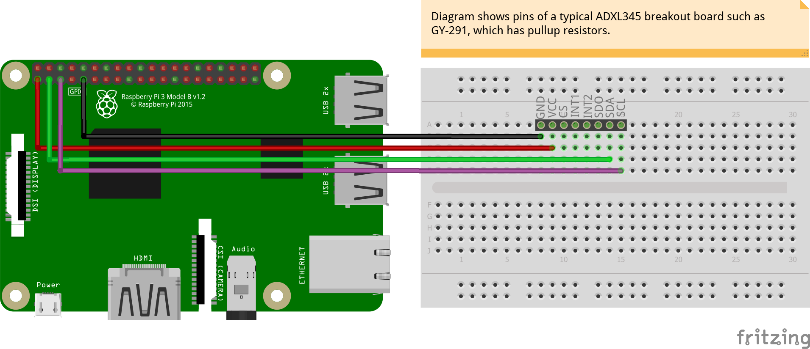

# adxl345_i2c
<table><tr>
<td>
 
</td>
<td>
<b>Boards</b>
<pre>Raspberry Pi 2, 3</pre>

<b>Description</b>
<pre>Interface Raspberry Pi with ADXL345 accelerometer via I2C.
We use the Adafruit Python ADXL345 for this purpose.
This can installed with "sudo pip3 install adafruit-adxl345"
See https://github.com/adafruit/Adafruit_Python_ADXL345
Ensure that I2C is enabled via raspi-config.
Ensure that line i2c-dev is present in file /etc/modules
</pre>

</td>
</tr></table>

