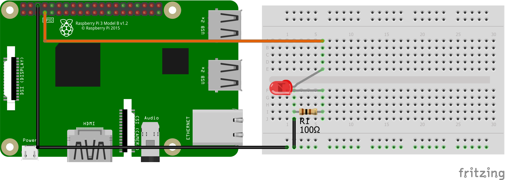

# Blink-Fade
<table><tr>
<td>
 
</td>
<td>
<b>Boards</b>
<pre>Raspberry Pi 3</pre>

<b>Description</b>
<pre>Use RPi.GPIO module to blink or fade an LED. Execution
switches between the two whenever a push button is pressed
and released. Fading uses software PWM since RPi.GPIO
module does not support hardware PWM. Note that RPi.GPIO
is available by default on Raspbian Jessie.
</pre>

</td>
</tr></table>

