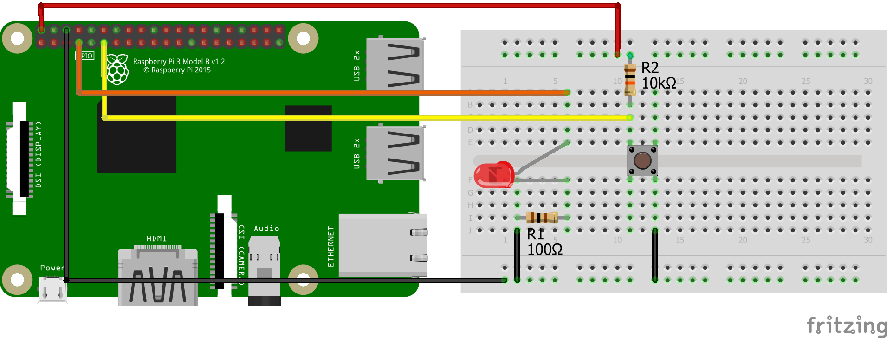

# led_pushbutton
<table><tr>
<td>
 
</td>
<td>
<b>Boards</b>
<pre>Raspberry Pi 2, 3</pre>

<b>Description</b>
<pre>Use GPIO Zero module to control an LED. LED state toggles
whenever a push button is pressed and released.
</pre>

</td>
</tr></table>

