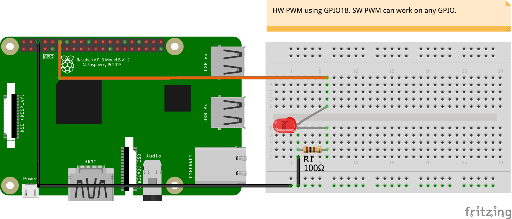

# WiringPi-PWM
<table><tr>
<td>
 
</td>
<td>
<b>Boards</b>
<pre>Raspberry Pi 3</pre>

<b>Description</b>
<pre>Use WiringPi-Python binding of WiringPi C implementation.
Source: https://github.com/WiringPi/WiringPi-Python
This example shows HW PWM on GPIO18. Code shows the use
of SW PWM, which is possible on any GPIO pin.
</pre>

</td>
</tr></table>

